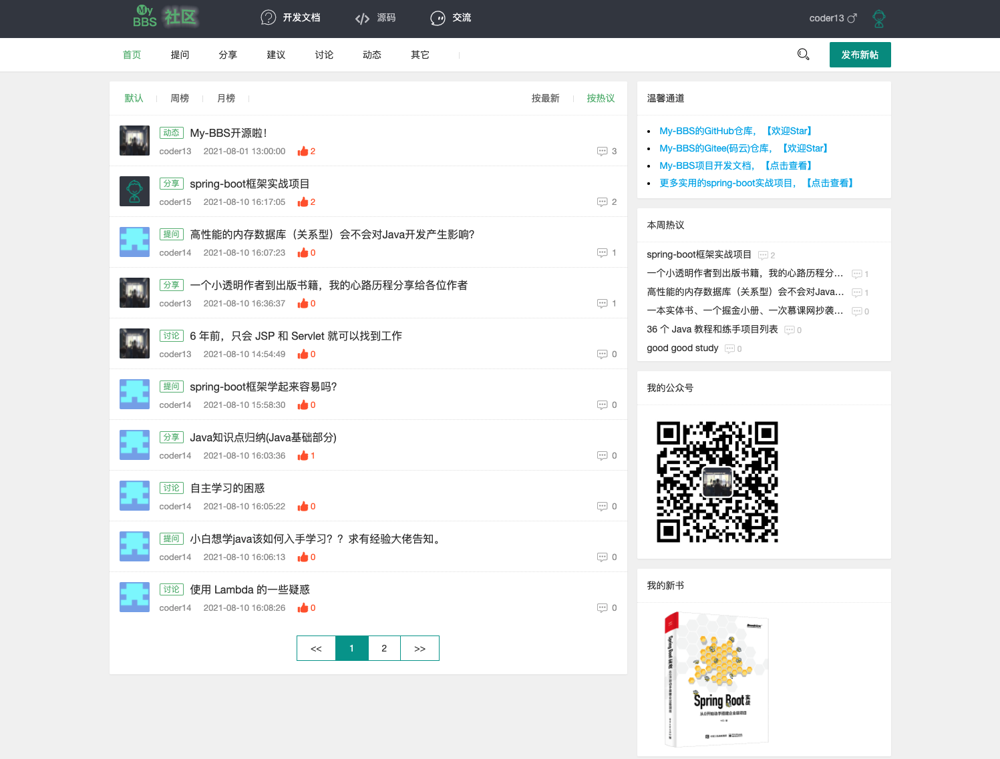
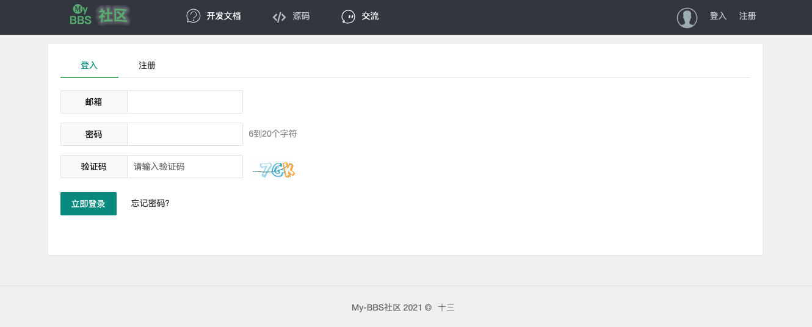
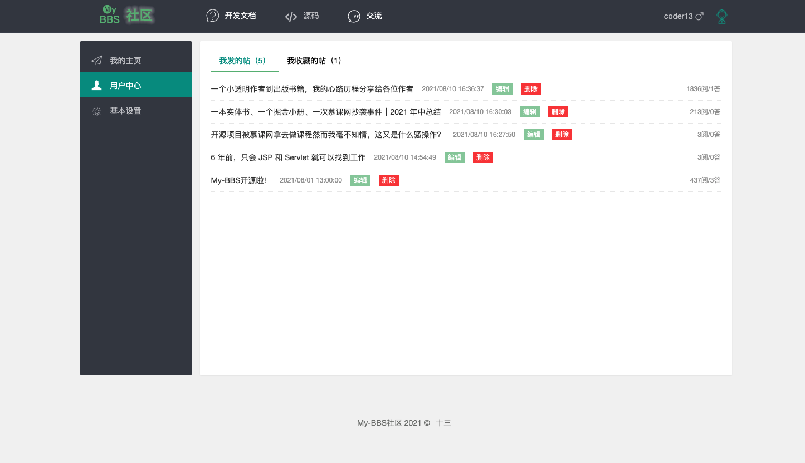
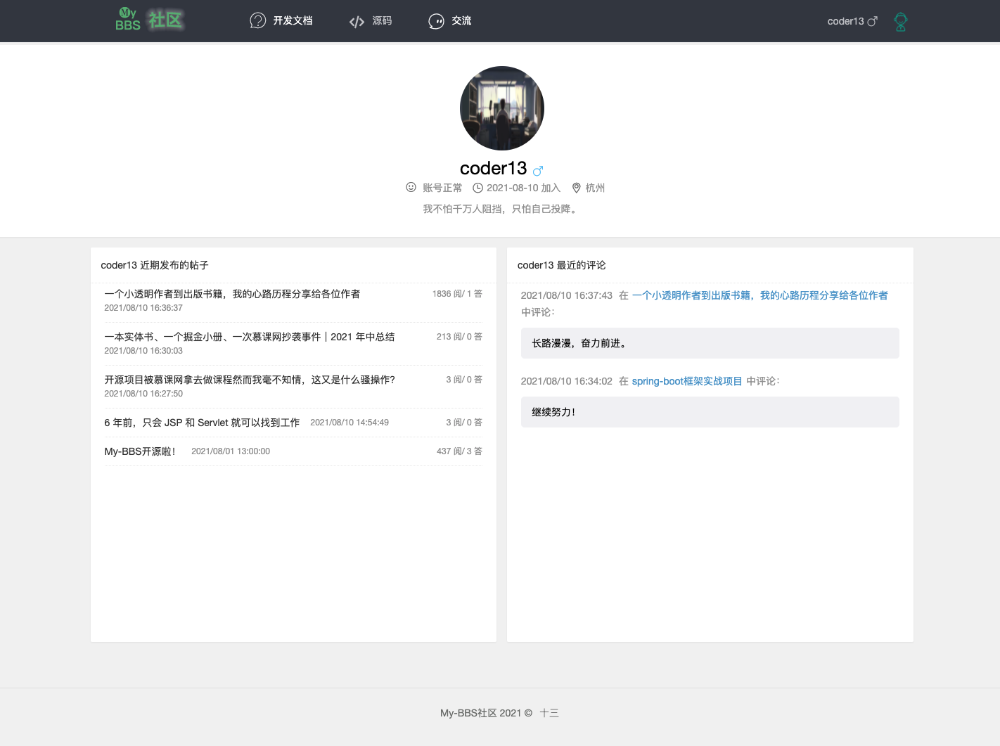
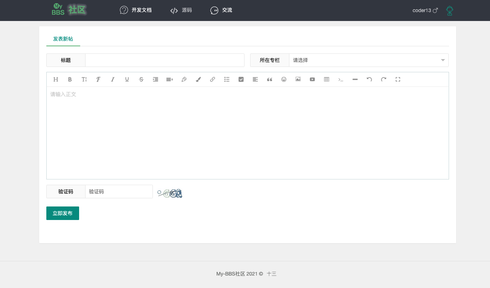
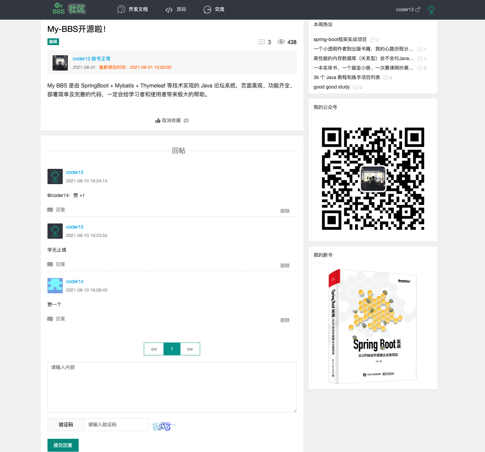

# 一、简介

My BBS 是由 SpringBoot + Mybatis + Thymeleaf 等技术实现的 Java 论坛系统，页面美观、功能齐全、部署简单及完善的代码，一定会给学习者和使用者带来极大的帮助。

spring Boot 版本为 2.4.0

- **一个以 Spring Boot 技术栈实现的 BBS 论坛实战项目；**


# 二、部署

1.使用.sql中的语句建表

2.使用idea连接数据库中的springboot3_db表

3.改application.properties文件中的

```
spring.datasource.username=
spring.datasource.password=
````

为自己的

5.运行Application

6.浏览器打开 http://localhost:8080 主页

# 三、效果预览

下面的这个展示就是原项目的展示哩

- 首页

  

- 登录

  

- 用户中心

  
  
- 用户动态

  

- 发布帖子

  

- 帖子详情

  

# 四、总结

**1.Spring**

为了降低Java开发的复杂性，Spring采用了以下4种关键策略：

1、基于POJO的轻量级和最小侵入性编程；

2、通过依赖注入（DI）和面向接口实现松耦合；

3、基于切面（AOP）和惯例进行声明式编程；

4、通过切面和模版减少样式代码；

**2.SpringBoot四个主要特性**

1、SpringBoot Starter：他将常用的依赖分组进行了整合，将其合并到一个依赖中，这样就可以一次性添加到项目的Maven或Gradle构建中；

2、自动配置：SpringBoot的自动配置特性利用了Spring4对条件化配置的支持，合理地推测应用所需的bean并自动化配置他们；

3、命令行接口：（Command-line-interface, CLI）：SpringBoot的CLI发挥了Groovy编程语言的优势，并结合自动配置进一步简化Spring应用的开发；

4、Actuatir：它为SpringBoot应用的所有特性构建一个小型的应用程序。但首先，我们快速了解每项特性，更好的体验他们如何简化Spring编程模型。
